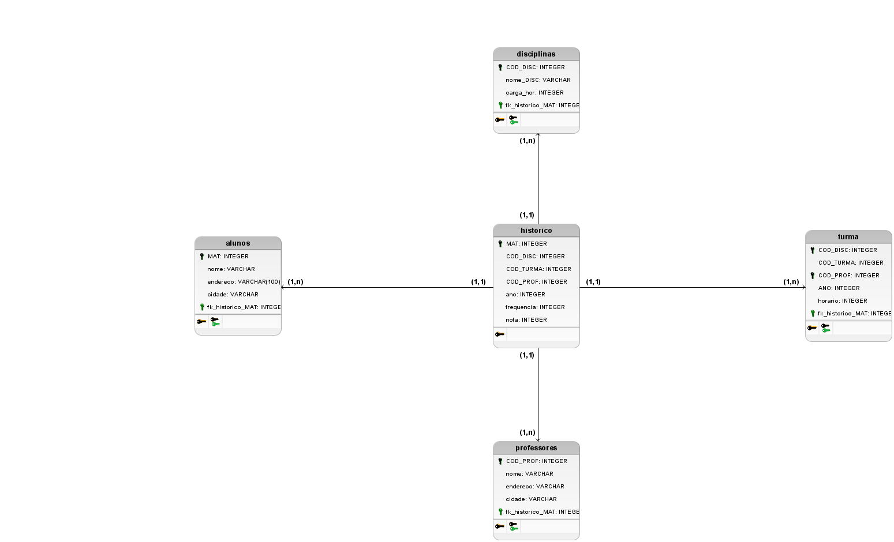

# Modelagem do Banco de Dados
Repositório para modelagem do banco de dados

  

<h2>Tabela <i>Alunos</i></h2>
A tabela <i>alunos</i> descreve dentro no modelo relacional elaborado, onde e quais atributos iremos manter no banco
sobre nosso sistema do aluno.
Nela possuímos os atributos/colunas:
<ul>
  <li>MAT: chave primária da tabela</li>
  <li>Nome: nome do aluno.</li>
  <li>Endereço: local onde reside o aluno</li>
  <li>Cidade: cidade onde mora</li>
  <li>fk_historico_MAT: chave estrangeira que faz referência a tabela <i>historico</i></li>
</ul>

<h2>Tabela <i>Disciplinas</i></h2>
A tabela <i>disciplina</i> será na nossa base de dados a responsável por manter os dados das disciplinas do sistema.
Nela possuímos os atributos/colunas:
<ul>
  <li>COD_DISC: chave primária da tabela</li>
  <li>Nome_DISC: nome da materia</li>
  <li>Carga_hor: horario das aulas</li>
  <li>fk_historico_MAT:chave estrangeira que faz referência a tabela <i>historico</i></li>
  </ul>

<h2>Tabela <i>Professores</i></h2>
Tabela de <i>professores</i> aqui teremos na nossa base informações sobre os professores.
Nela possuímos os atributos/colunas:
<ul>
  <li>COD_PROF: chave primária da tabela</li>
  <li>Nome: nome do professor</li>
  <li>Endereço:local onde reside o professor </li>
  <li>Cidade: cidade onde mora</li>
  <li>fk_historico_MAT:chave estrangeira que faz referência a tabela <i>histroico</></li>
 </ul>
 
<h2>Tabela <i>Turma</i></h2>
Tabela <i></i> com as informações sobre a turma </i></i> <i></i>.
Nela possuímos os atributos/colunas:
<ul>
  <li>COD_DISC: chave estrangeira que faz referência a tabela <i>instituicoes</i></li>
  <li>COD_TURMA: chave estrangeira que faz referência a tabel <i>orgao</i> </li>
</ul>

<h2>Tabela <i>forum</i></h2>
Tabela <i>forum</i> nesta tabela tivemos a ideia para que a comunidade do sistema a ser desenvolvido pudessem ter a possibilidade
de compartilhar dúvidas e manter tópicos de perguntas e respostas associadas aos usuários que fizerem.
Nela possuímos os atributos/colunas:
<ul>
  <li>topico: onde o usuário poderá criar um tópico sobre determinado tema ou dúvida</li>
  <li>comentario: onde os usários poderão comentar sobre os tópicos criados</li>
</ul>

